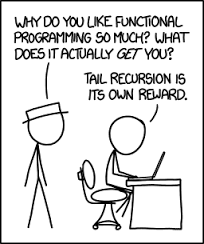
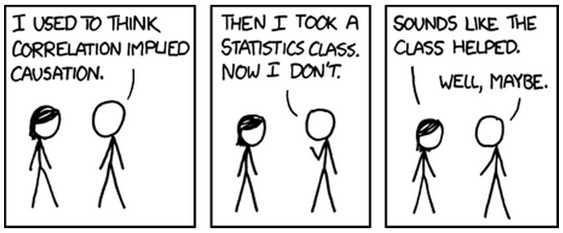

### Jekyll / Web development 
* [The Jekyll conference](http://jekyllconf.com/) in particular @katydecorah's [presentation](https://www.youtube.com/watch?v=s84wFRD8vfE)
* Introduction to web development and Jekyll [devtips](http://bit.ly/2p0MrSw)
* Some basic css to fix common design mistakes [web design in 4 minutes](http://jgthms.com/web-design-in-4-minutes/)
* A free HML and CSS tutorial [marksheet](http://marksheet.io/)

{: .figure}

### R programing links
* Learn knitr and rmarkdown - [a short intro](http://kbroman.org/knitr_knutshell/), [documentation](https://yihui.name/knitr/), [comprehensive book](https://www.amazon.com/gp/product/1498716962?ie=UTF8&tag=7210-20)
* Rcpp and RcppArmadillo - [Hadle Wickham's Rccp intro](http://adv-r.had.co.nz/Rcpp.html), [Dirk Eddelbuettel's Rcpp intro](http://dirk.eddelbuettel.com/code/rcpp.html) and the [Armadillo library](http://arma.sourceforge.net/docs.html)

{: .figure}

### Statistics Links
* Talk on [Post-Selection Inference for Lasso](https://www.youtube.com/watch?v=RKQJEvc02hc)
* Talk on [Distributed optimization via Alternating Direction Method of Multipliers](https://www.youtube.com/watch?v=Xg0ozgCXXB8)
* Generalised Lasso [paper](https://projecteuclid.org/euclid.aos/1304514656) 

{: .figure}

